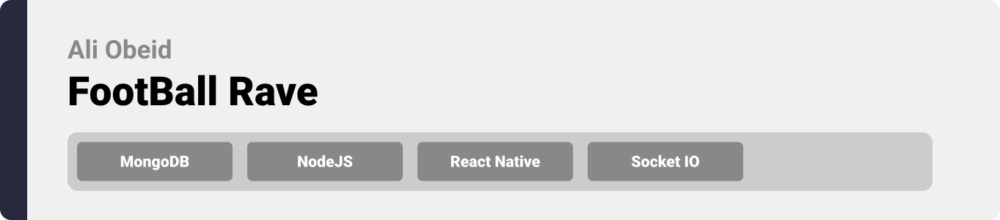
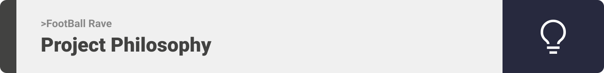

<div align="center">

> Hello world! This is the project’s summary that describes the project plain and simple, limited to the space available. 
 


**[PROJECT PHILOSOPHY](https://github.com/julescript/well_app#-project-philosophy) • [WIREFRAMES](https://github.com/julescript/well_app#-wireframes) • [TECH STACK](https://github.com/julescript/well_app#-tech-stack) • [IMPLEMENTATION](https://github.com/julescript/well_app#-impplementation) • [HOW TO RUN?](https://github.com/julescript/well_app#-how-to-run)**

</div>

<br><br>




> FootBallRave gives you all the live scores, stats, and storylines to keep you up to speed with the world of soccer.
> 
> Features include:

>• Live match scores.

>• League details : team, fixtures, tables, and Top Scores.

>• Team details: matches, linup, transfers and squad.

>• Notifications on match start, match end and team scored.

>• Chat rooms: join your favorite team room and chats with fans.

### User Stories
- As a user, I want to browse Matches statistics , so that I can find live matches, upcoming matches and the already played.
- As a user, I want to browse Leagues, so that I can find my favorite league and check its statistics.
- As a user, I want to browse Teams, so that I can find my favorite team and check its statistics.
- As a user, I want to receive notifications when a match start, match end and team scored.
- As a user, I want to chat with my favorite team fans in a chat room or create my own room.


<br><br>


> This design was planned before on paper, then moved to Figma app for the fine details.
Note that i didn't use any styling library or theme, all from scratch and using pure css modules

<br><br>


Here's a brief high-level overview of the tech stack the Well app uses:

- This project uses [React Native EXPO](https://expo.dev/) for the Frontend. Expo is a bundle of tools created around React Native to help you start an app very fast.
- This project uses [ExpressJS](https://expressjs.com/) for the Backend. Fast, unopinionated, minimalist web framework for [NodeJS](https://nodejs.org/en/).
- For persistent storage (database), the app uses the [Mongoose ODM](https://mongoosejs.com) package which allows the app to create a custom storage schema and save it to [MongoDB](https://www.mongodb.com).


<br><br>


> Uing the above mentioned tecch stacks and the wireframes build with figma from the user sotries we have, the implementation of the app is shown as below, these are screenshots from the real app

<br><br>


> This is an example of how you may give instructions on setting up your project locally.
To get a local copy up and running follow these simple example steps.

### Prerequisites

This is an example of how to list things you need to use the software and how to install them.
* npm
  ```sh
  npm install npm@latest -g
  ```

### Installation

_Below is an example of how you can instruct your audience on installing and setting up your app. This template doesn't rely on any external dependencies or services._

~~ Frontend:
1. Clone the repo
   ```sh
   git clone https://github.com/AliObeid01/FootballRave.git
   ```
2. Navigate to the frontend folder
   ```sh
   cd frontend/
   ```
3. Install NPM packages
   ```sh
   npm install
   ```
   🚨 you might need to run `npm install --force`  if you face any dependency conflicts.
4. Install Expo CLI
   ```sh
   npm install --global expo-cli
   ```
5. Install Expo Go app for Android (Optional)
   > [Android Play Store](https://play.google.com/store/apps/details?id=host.exp.exponent)
6. Run the Start-Up Command
   ```sh
   npx expo start -c
   ```
7. Scan the QR Code with Expo Go App.
    -or-
   Press 'a' to run locally on Android Emulator (Requires an Active Android Emulator [Android Studio](https://developer.android.com/studio/install)).
   
~~ Backend:
1. Navigate to the backend folder (from root folder)
   ```sh
   cd backend/
   ```
2. Install NPM packages
   ```sh
   npm install
   ```
3. Rename `.env.example` to `.env` then set your credentials.
4. Run the Start-Up Command
   ```sh
   npm start
   ```


